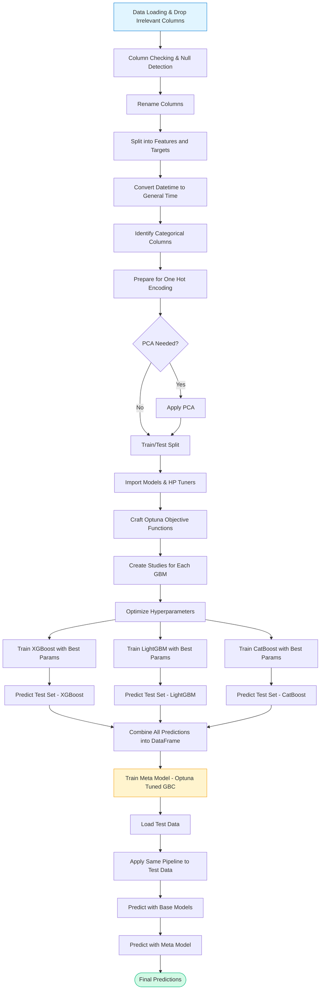

# Here is a quick lookup of the pipeline.

```mermaid
flowchart TD
    A[Data Loading & Drop Irrelevant Columns] --> B[Column Checking & Null Detection]
    B --> C[Rename Columns]
    C --> D[Split into Features and Targets]
    D --> E[Convert Datetime to General Time]
    E --> F[Identify Categorical Columns]
    F --> G[Prepare for One Hot Encoding]
    G --> H{PCA Needed?}
    H -->|Yes| I[Apply PCA]
    H -->|No| J[Train/Test Split]
    I --> J
    J --> K[Import Models & HP Tuners]
    K --> L[Craft Optuna Objective Functions]
    L --> M[Create Studies for Each GBM]
    M --> N[Optimize Hyperparameters]
    N --> O[Train XGBoost with Best Params]
    N --> P[Train LightGBM with Best Params]
    N --> Q[Train CatBoost with Best Params]
    O --> R[Predict Test Set - XGBoost]
    P --> S[Predict Test Set - LightGBM]
    Q --> T[Predict Test Set - CatBoost]
    R --> U[Combine All Predictions into DataFrame]
    S --> U
    T --> U
    U --> V[Train Meta Model - Optuna Tuned GBC]
    V --> W[Load Test Data]
    W --> X[Apply Same Pipeline to Test Data]
    X --> Y[Predict with Base Models]
    Y --> Z[Predict with Meta Model]
    Z --> END([Final Predictions])
    
    style A fill:#e1f5ff,stroke:#0078d4
    style END fill:#d1fae5,stroke:#10b981
    style V fill:#fff4ce,stroke:#f59e0b
```