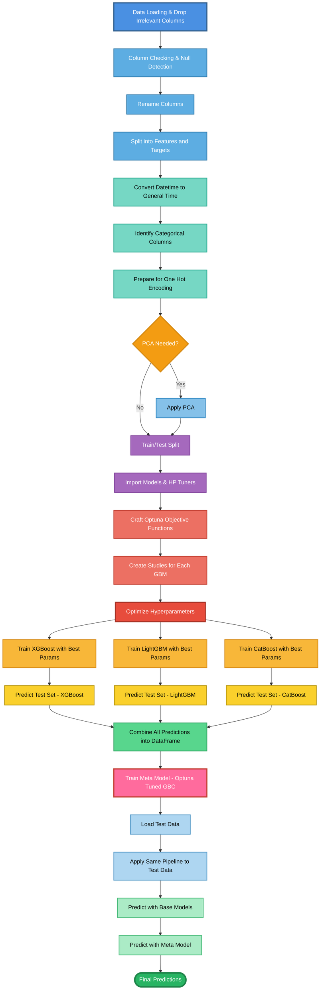

```mermaid
flowchart TD
    A[Data Loading & Drop Irrelevant Columns] --> B[Column Checking & Null Detection]
    B --> C[Rename Columns]
    C --> D[Split into Features and Targets]
    D --> E[Convert Datetime to General Time]
    E --> F[Identify Categorical Columns]
    F --> G[Prepare for One Hot Encoding]
    G --> H{PCA Needed?}
    H -->|Yes| I[Apply PCA]
    H -->|No| J[Train/Test Split]
    I --> J
    J --> K[Import Models & HP Tuners]
    K --> L[Craft Optuna Objective Functions]
    L --> M[Create Studies for Each GBM]
    M --> N[Optimize Hyperparameters]
    N --> O[Train XGBoost with Best Params]
    N --> P[Train LightGBM with Best Params]
    N --> Q[Train CatBoost with Best Params]
    O --> R[Predict Test Set - XGBoost]
    P --> S[Predict Test Set - LightGBM]
    Q --> T[Predict Test Set - CatBoost]
    R --> U[Combine All Predictions into DataFrame]
    S --> U
    T --> U
    U --> V[Train Meta Model - Optuna Tuned GBC]
    V --> W[Load Test Data]
    W --> X[Apply Same Pipeline to Test Data]
    X --> Y[Predict with Base Models]
    Y --> Z[Predict with Meta Model]
    Z --> END([Final Predictions])
    
    style A fill:#4A90E2,stroke:#2E5C8A,stroke-width:3px,color:#FFFFFF
    style B fill:#5DADE2,stroke:#2874A6,stroke-width:2px,color:#FFFFFF
    style C fill:#5DADE2,stroke:#2874A6,stroke-width:2px,color:#FFFFFF
    style D fill:#5DADE2,stroke:#2874A6,stroke-width:2px,color:#FFFFFF
    style E fill:#76D7C4,stroke:#16A085,stroke-width:2px,color:#000000
    style F fill:#76D7C4,stroke:#16A085,stroke-width:2px,color:#000000
    style G fill:#76D7C4,stroke:#16A085,stroke-width:2px,color:#000000
    style H fill:#F39C12,stroke:#D68910,stroke-width:3px,color:#FFFFFF
    style I fill:#85C1E9,stroke:#2E86C1,stroke-width:2px,color:#000000
    style J fill:#A569BD,stroke:#7D3C98,stroke-width:2px,color:#FFFFFF
    style K fill:#A569BD,stroke:#7D3C98,stroke-width:2px,color:#FFFFFF
    style L fill:#EC7063,stroke:#C0392B,stroke-width:2px,color:#FFFFFF
    style M fill:#EC7063,stroke:#C0392B,stroke-width:2px,color:#FFFFFF
    style N fill:#E74C3C,stroke:#A93226,stroke-width:3px,color:#FFFFFF
    style O fill:#F8B739,stroke:#D68910,stroke-width:2px,color:#000000
    style P fill:#F8B739,stroke:#D68910,stroke-width:2px,color:#000000
    style Q fill:#F8B739,stroke:#D68910,stroke-width:2px,color:#000000
    style R fill:#FAD02C,stroke:#B7950B,stroke-width:2px,color:#000000
    style S fill:#FAD02C,stroke:#B7950B,stroke-width:2px,color:#000000
    style T fill:#FAD02C,stroke:#B7950B,stroke-width:2px,color:#000000
    style U fill:#58D68D,stroke:#239B56,stroke-width:2px,color:#000000
    style V fill:#FF6B9D,stroke:#C0392B,stroke-width:3px,color:#FFFFFF
    style W fill:#AED6F1,stroke:#5499C7,stroke-width:2px,color:#000000
    style X fill:#AED6F1,stroke:#5499C7,stroke-width:2px,color:#000000
    style Y fill:#ABEBC6,stroke:#52BE80,stroke-width:2px,color:#000000
    style Z fill:#ABEBC6,stroke:#52BE80,stroke-width:2px,color:#000000
    style END fill:#28B463,stroke:#1E8449,stroke-width:4px,color:#FFFFFF

```
